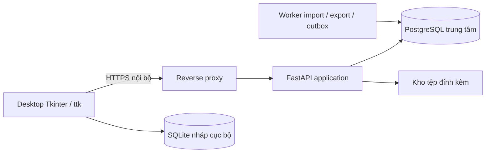

# WMS — Hệ thống quản lý kho desktop qua LAN

[](https://github.com/TEAM-DEV-FIVE/WMS_BA_2_0/actions/workflows/validate.yml)

Bộ hồ sơ phân tích nghiệp vụ (BA) và thiết kế kỹ thuật cho hệ thống quản lý kho dùng **Python/Tkinter, FastAPI và PostgreSQL**, phiên bản hồ sơ **2.0**.

**Trạng thái: DRAFT, chờ thẩm định nghiệp vụ.** Repository hiện có tài liệu, schema SQL, hợp đồng API, sơ đồ, mẫu nhập liệu và công cụ kiểm tra. **Chưa có backend FastAPI, ứng dụng Tkinter hoặc bộ cài WMS chạy được.** Các công nghệ trên là kiến trúc dự kiến; cài dependencies kiểm tra không khởi động ứng dụng.

## Mục lục

- [Phạm vi nghiệp vụ](#phạm-vi-nghiệp-vụ)
- [Kiến trúc dự kiến](#kiến-trúc-dự-kiến)
- [Cấu trúc repository](#cấu-trúc-repository)
- [Lộ trình đọc tài liệu](#lộ-trình-đọc-tài-liệu)
- [Thiết lập và kiểm tra nhanh](#thiết-lập-và-kiểm-tra-nhanh)
- [Kiểm tra PostgreSQL](#kiểm-tra-postgresql)
- [Nhập dữ liệu mẫu](#nhập-dữ-liệu-mẫu)
- [API và phân quyền](#api-và-phân-quyền)
- [Chỉnh sửa và đóng góp](#chỉnh-sửa-và-đóng-góp)
- [Kết quả kiểm tra và giới hạn](#kết-quả-kiểm-tra-và-giới-hạn)
- [Lộ trình triển khai](#lộ-trình-triển-khai)

## Phạm vi nghiệp vụ

- Danh mục hàng, đơn vị tính/quy đổi, barcode, đối tác, kho và vị trí.
- Mua/bán, nhận/xuất hàng từng phần, giữ chỗ, soạn hàng và đóng kiện.
- Theo dõi hàng thường, theo lô/hạn dùng hoặc theo serial.
- Chuyển kho qua vị trí trung chuyển; trả hàng, điều chỉnh và đảo giao dịch.
- Phê duyệt, kiểm kê, khóa kỳ, audit và phân quyền theo kho.
- Nhập liệu theo staging/preview/commit; 8 báo cáo, 4 mẫu in, 2 loại tem trong phạm vi thiết kế.

Quy mô **đề xuất để kiểm thử**: một doanh nghiệp, 5 kho, 100 tài khoản, 30 người đồng thời, 50.000 SKU, 1 triệu dòng sổ và tối đa 200 dòng/phiếu. Đây chưa phải kết quả benchmark. Multi-company/3PL, giá vốn kế toán, RFID, mobile native và ghi sổ offline nằm ngoài phạm vi cơ sở.

## Kiến trúc dự kiến



PostgreSQL là nguồn dữ liệu chính thức; desktop gọi API và không giữ thông tin đăng nhập DB. SQLite chỉ lưu nháp/cache cục bộ, không dùng làm cơ sở dữ liệu dùng chung qua mạng. Lệnh ghi sổ phải xử lý quyền, version, idempotency, ledger/balance, audit và outbox trong cùng transaction. UI cập nhật widget trên main thread; HTTP chạy qua worker/queue.

Chi tiết: [ARCHITECTURE.md](01_Tai_lieu/ARCHITECTURE.md), [INVARIANTS.md](01_Tai_lieu/INVARIANTS.md), [các quyết định cần chốt](01_Tai_lieu/DECISIONS.md).

## Cấu trúc repository

| Đường dẫn | Nội dung |
| --- | --- |
| [01_Tai_lieu](01_Tai_lieu) | Tài liệu tổng 61 trang, BRD/SRS, 47 yêu cầu, 31 use case, quy tắc và hồ sơ kỹ thuật |
| [02_CSDL](02_CSDL) | PostgreSQL DDL/seed, DBML, mô hình 56 bảng/355 cột/105 FK, SQLite local draft và truy vấn đối soát |
| [03_So_do](03_So_do) | Atlas 91 trang, SVG, draw.io, PlantUML; ERD, class, use case, trạng thái, sequence, BPMN và mô hình khái niệm |
| [04_Phan_quyen](04_Phan_quyen) | 10 vai trò, 53 quyền, 108 ánh xạ role-permission, policy và phạm vi quyền |
| [05_API](05_API) | OpenAPI 3.0.3 gồm 16 paths lõi; bảng coverage theo use case |
| [06_Nhap_lieu](06_Nhap_lieu) | Excel, 14 CSV templates, 22 dòng ví dụ và validator offline |
| [07_Kiem_tra](07_Kiem_tra) | Báo cáo kiểm tra, truy vết và đặc tả acceptance T01–T26 |
| [scripts](scripts) | Kiểm tra artifact/PostgreSQL và cập nhật ZIP/checksum |
| [tests](tests) | Test hồi quy CSV và SQL smoke test |
| [.github/workflows/validate.yml](.github/workflows/validate.yml) | CI kiểm tra artifact, CSV và SQL trên PostgreSQL 15/16 |
| [SHA256SUMS.txt](SHA256SUMS.txt) | Checksum các file repository, ngoại trừ chính manifest |

## Lộ trình đọc tài liệu

1. [Cách đọc hồ sơ BA](01_Tai_lieu/BA/00_CACH_DOC.md) và [tài liệu tổng PDF](01_Tai_lieu/Thiet_ke_WMS_Tkinter_LAN.pdf).
2. [BRD](01_Tai_lieu/BA/01_BRD.md), [SRS](01_Tai_lieu/BA/03_SRS.md), [quy trình](01_Tai_lieu/BA/04_QUY_TRINH.md) và [use case](01_Tai_lieu/USE_CASES.md).
3. [Kiến trúc](01_Tai_lieu/ARCHITECTURE.md), [bất biến giao dịch](01_Tai_lieu/INVARIANTS.md), [RBAC](04_Phan_quyen/RBAC.md) và [hợp đồng API](05_API/README.md).
4. [Atlas sơ đồ PDF](03_So_do/00_Tong_hop/Diagram_Atlas.pdf), [mục lục sơ đồ](03_So_do/00_Tong_hop/diagram_index.md) và [từ điển dữ liệu](02_CSDL/data_dictionary.csv).
5. [Báo cáo rà soát hiện tại](07_Kiem_tra/PROJECT_REVIEW.md) và [câu hỏi còn mở Q01–Q08](01_Tai_lieu/BA/open_questions.json).

## Thiết lập và kiểm tra nhanh

Yêu cầu: Git và Python **3.12+**. PostgreSQL chỉ cần cho kiểm tra SQL. Đọc PDF/SVG/Markdown không cần cài Python.

```bash
git clone https://github.com/TEAM-DEV-FIVE/WMS_BA_2_0.git
cd WMS_BA_2_0
python3 -m venv .venv
source .venv/bin/activate
python -m pip install -r requirements-dev.txt
python -m unittest discover -s tests -v
python scripts/check_artifacts.py
```

Windows PowerShell: thay hai lệnh tạo/kích hoạt môi trường bằng `py -3.12 -m venv .venv` và `.\.venv\Scripts\Activate.ps1`; các lệnh `python` sau đó giữ nguyên. Với repo private, tài khoản GitHub phải có quyền đọc. Trên Ubuntu, nếu thiếu module `venv`, cài gói `python3-venv` tương ứng.

`check_artifacts.py` kiểm tra định dạng JSON/CSV/XML/XLSX/ZIP, liên kết Markdown nội bộ, tham chiếu draw.io/BPMN, mô hình dữ liệu/FK, ma trận quyền, traceability, OpenAPI, SQLite và checksum. Bất kỳ lỗi nào phải được xử lý trước commit. CI chạy cùng bộ kiểm tra khi push hoặc mở pull request.

## Kiểm tra PostgreSQL

DDL yêu cầu **PostgreSQL 15+** và database trống; không phải migration nâng cấp database đã có dữ liệu. Seed tạo vai trò/quyền nghiệp vụ, không tạo người dùng WMS hay mật khẩu mặc định.

Trên Linux/macOS đã có bộ công cụ server PostgreSQL (`pg_config`, `initdb`, `pg_ctl`, `psql`), chạy bằng tài khoản thường:

```bash
python scripts/check_postgres.py
```

Lệnh tạo cluster tạm, chỉ mở Unix socket trong thư mục tạm, nạp DDL/seed, kiểm tra các ràng buộc và trigger, đối chiếu cột SQL với JSON và quyền seed với policy, rồi dừng/xóa cluster. Không kết nối database đang vận hành. Script đã được chạy trên Linux/PostgreSQL 16.15; macOS chưa được kiểm thử trực tiếp.

Nếu đã chuẩn bị **database phát triển trống** với quyền tạo schema, dùng `psql` trên Linux/macOS/Windows:

```bash
psql -X -h localhost -U wms_dev -d wms_dev -v ON_ERROR_STOP=1 -f 02_CSDL/001_schema.sql
psql -X -h localhost -U wms_dev -d wms_dev -v ON_ERROR_STOP=1 -f 02_CSDL/002_seed_permissions.sql
psql -X -h localhost -U wms_dev -d wms_dev -v ON_ERROR_STOP=1 -f tests/sql/schema_smoke.sql
psql -X -h localhost -U wms_dev -d wms_dev -v ON_ERROR_STOP=1 -f 02_CSDL/reconcile.sql
```

Thay host/user/database bằng cấu hình của bạn; để `psql` hỏi mật khẩu hoặc dùng cơ chế quản lý mật khẩu PostgreSQL. Không ghi thông tin đăng nhập thật vào repository. Bốn truy vấn đối soát phải trả **0 dòng** trên database vừa khởi tạo. Smoke test tự rollback dữ liệu giả; DDL/seed chỉ chạy một lần trên DB trống.

## Nhập dữ liệu mẫu

```bash
python 06_Nhap_lieu/imports/validate_csv.py 06_Nhap_lieu/imports/examples
python 06_Nhap_lieu/imports/validate_csv.py 06_Nhap_lieu/imports/templates
```

Kết quả mẫu: `rows_checked: 22`, `errors: []`; templates chỉ có header nên là 0 dòng. Exit code: **0** hợp lệ, **1** lỗi dữ liệu/tệp, **2** sai tham số. Có thể kiểm tra một phần các mẫu nếu giữ đúng tên CSV theo manifest. Thư mục không tồn tại/rỗng, tên file lạ, sai header, thiếu/thừa cột, encoding hoặc kiểu dữ liệu đều bị báo lỗi.

CSV dùng UTF-8 BOM, dấu phẩy phân cột và dấu chấm thập phân. Mã/barcode/serial phải giữ số 0 đầu. Excel có 14 sheet nhập liệu cùng 2 sheet hướng dẫn/quy tắc. Dữ liệu examples là dữ liệu giả; validator chưa kiểm tra FK, quyền, tồn kho hoặc các quy tắc nghiệp vụ. Việc nạp thật cần server dry-run và phê duyệt khi phần ứng dụng được triển khai. Xem [hướng dẫn nhập liệu](06_Nhap_lieu/imports/README.md).

## API và phân quyền

[openapi_core.json](05_API/openapi_core.json) là hợp đồng thiết kế, có thể mở bằng công cụ hỗ trợ OpenAPI. `https://wms.example.internal/api/v1` là địa chỉ minh họa. Có path trong hợp đồng chưa đồng nghĩa endpoint đã chạy.

Hợp đồng mô tả lệnh ghi sổ, giữ chỗ, chuyển kho, duyệt, kiểm kê, commit nhập và tra cứu operation. Decimal truyền dạng chuỗi; lệnh thay đổi dùng idempotency và kiểm soát version. Coverage của từng UC được ghi rõ tại [BA_COVERAGE.md](05_API/BA_COVERAGE.md); đăng nhập/MFA, nhiều CRUD, báo cáo và các luồng khác còn thiếu hoặc mới một phần.

Quyền phải kiểm tra ở server theo kho, thời hạn grant, trạng thái tài nguyên và phân tách nhiệm vụ. Vai trò `SYSADMIN` không mặc nhiên được làm nghiệp vụ kho. [policy.json](04_Phan_quyen/policy.json) và [ma trận quyền](04_Phan_quyen/role_permission_matrix.csv) mô tả thiết kế; chưa phải cơ chế authorization đã triển khai.

## Chỉnh sửa và đóng góp

- Giữ mã requirement/use case/business rule và cập nhật [traceability](07_Kiem_tra/BA/traceability.md) khi thay đổi yêu cầu.
- Sửa sơ đồ bằng [WMS_Design.drawio](03_So_do/00_Tong_hop/WMS_Design.drawio) hoặc draw.io từng nhóm; đồng bộ SVG/PDF và mô hình liên quan. Nguồn PlantUML giữ ngữ nghĩa nhưng có thể render bố cục khác. BPMN là mô hình non-executable.
- Khi sửa CSDL, đồng bộ `model.json`, SQL, DBML, từ điển dữ liệu và các sơ đồ chịu ảnh hưởng. Sau khi có hệ thống đang chạy, cần migration có phiên bản thay vì nạp lại DDL nền.
- Không commit `.venv`, cache, DB local, `.env`, mật khẩu hoặc khóa bí mật. Git giữ nguyên byte CSV để bảo toàn BOM/CRLF và checksum.
- Chưa có file LICENSE; tác giả chưa chỉ định giấy phép phân phối lại.

Sau khi kiểm tra nội dung thay đổi, đồng bộ ZIP nhập liệu và checksum, rồi chạy kiểm tra:

```bash
python scripts/update_artifacts.py
python -m unittest discover -s tests -v
python scripts/check_artifacts.py
python scripts/check_postgres.py
git diff --check
git status --short
```

`update_artifacts.py` lấy danh sách file từ Git, gồm file đã theo dõi và file mới chưa bị ignore. Rà soát `git status` trước khi chạy để tránh đưa file ngoài ý muốn vào manifest. Lệnh này chỉ tái tạo ZIP nhập liệu/checksum, **không tự sinh lại PDF hoặc sơ đồ**. Nếu chỉ đọc/clone thì không cần chạy cập nhật.

## Kết quả kiểm tra và giới hạn

Lần rà soát ngày **27/09/2026**: 12 test CSV đạt; JSON/CSV/XML, OpenAPI và SQLite hợp lệ; PostgreSQL 16.15 nạp DDL/seed thành công, kiểm tra 17 trường hợp bị từ chối bởi FK/CHECK/UNIQUE/trigger, đối chiếu schema/quyền và đối soát DB rỗng đạt. Chi tiết và phạm vi xem [PROJECT_REVIEW.md](07_Kiem_tra/PROJECT_REVIEW.md); trạng thái CI mới nhất ở badge đầu trang.

Repository hiện thuộc **TEAM-DEV-FIVE**. Sau khi chuyển repo, CI đã khởi chạy được; [lần chạy 36308545818](https://github.com/TEAM-DEV-FIVE/WMS_BA_2_0/actions/runs/36308545818) xác nhận hai job PostgreSQL 15/16 đạt và phát hiện thiếu đường dẫn cache cho `requirements-dev.txt`. Cấu hình cache đã được bổ sung; xem badge đầu trang để biết kết quả toàn bộ workflow trên commit mới nhất. Lỗi billing của lần push đầu tại tài khoản cũ được lưu trong báo cáo lịch sử.

Chưa triển khai hoặc nghiệm thu API/Tkinter, concurrency của posting service, benchmark, máy quét/in, backup/restore hay ba hệ điều hành đích. `acceptance_tests.csv` là **đặc tả T01–T26 chưa chạy ở mức ứng dụng**. Các báo cáo v1.x và BA trước đây là lịch sử; số liệu/trạng thái trong đó cần đọc theo phiên bản.

Q01–Q08 còn mở: ngân sách/dự phòng, ngành hàng/tracking, As-Is, người duyệt, tải thực tế, OS/thiết bị, KPI/RPO/RTO và chính sách biểu mẫu/lưu hồ sơ. Những điểm này cần xác nhận trước baseline nghiệp vụ và triển khai production.

## Lộ trình triển khai

1. Chốt yêu cầu, bằng chứng khảo sát và các câu hỏi Q01–Q08.
2. Khởi tạo backend/desktop theo kiến trúc, migration và cấu hình môi trường.
3. Triển khai IAM/RBAC, danh mục và CRUD chứng từ; hoàn thiện hợp đồng API.
4. Triển khai posting service theo bất biến, kiểm thử đồng thời/idempotency/rollback trên PostgreSQL thật.
5. Thêm nhận/xuất/chuyển kho, phê duyệt, kiểm kê, nhập liệu và báo cáo.
6. Chạy T01–T26, kiểm tra thiết bị, tải, backup/restore và đóng gói cho từng nền tảng.
